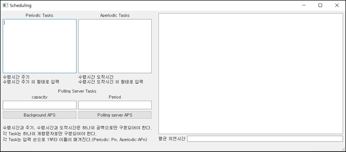
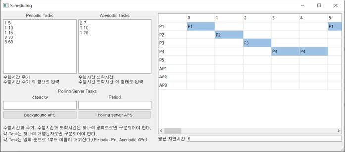
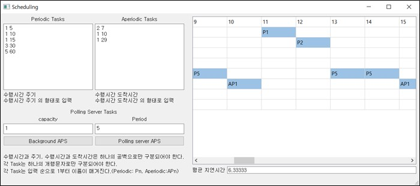
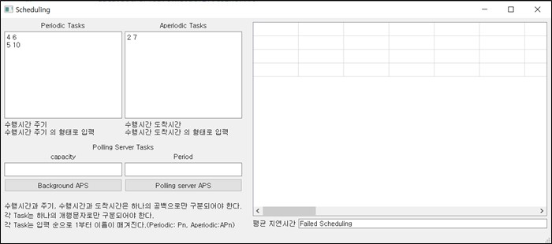

# Scheduling Task
### Used Data Structure
---
SortedLinkedList를 사용하여, Periodic Tasks와 Aperiodic Tasks를 정렬했습니다. 주기가 짧은 task의 우선 순위가 더 높기 때문에 주기순으로 정렬하는 Sort하여 List에 task들을 저장했습니다. Aperiodic task 또한 먼저 도착한 task가 먼저 수행되기 때문에 도착 시간에 따라 정렬하여 List에 저장해주었습니다.  
Task는 struct로 선언하여, task의 이름, 수행시간, 주기 그리고 Gantt Chart에서의 행 위치를 묶어주었습니다.
또한 각 Quantum time마다 task의 할당여부와 할당된 task의 이름을 Chart struct를 선언하여 나타냈습니다.  

### Implementation
---
Qt와 C++을 사용하여 구현했습니다. 
우선 입력 받은 task들을 List에 넣어줍니다. 그 다음 Periodic task들에 따라 HyperPeriod를 구합니다. HyperPeriod만큼 Chart를 동적할당 해줍니다. 
Background APS의 경우 주기가 제일 짧은 주기적 task부터 차례로 scheduling합니다. Computation time을 Quantum time 단위로 쪼개고, 각 time마다 동적할당한 ChartList에서 할당할 Quantum time이 비었는지 확인하고, 비었다면 할당을, 아니라면 다음 Quantum time을 확인합니다. 모든 주기적 task에 대해 반복한 후 비주기적 task의 scheduling을 시작합니다. 
비주기적 task는 도착시간부터, Quantum time을 확인하여, 비어 있는 제일 빠른 시간에 할당됩니다. 평균 지연 시간은 비주기적 task가 할당된 마지막 시간과 도착 시간을 뺀 것의 평균으로 계산했습니다. 
Polling server APS의 경우 Aperiodic task부터 scheduling 했습니다. Aperiodic Task를 polling server task의 주기마다 도착 여부를 확인해, 할당해 주었습니다. 마찬가지로 평균 지연 시간은 비주기적 task가 할당된 마지막 시간과 도착 시간을 뺀 것의 평균으로 계산했습니다.  
그 후 주기적 task는 Background APS와 같은 방식으로 구현했습니다. 
Gantt Chart는 task가 할당될 때마다 해당 Gantt Chart 부분을 채워주는 형식으로 구현했습니다.  

### Results
---
초기 화면입니다. 왼쪽에 각각 task의 정보를 입력하고, Background APS, Polling server APS 버튼을 누르면 해당 scheduling에 따라 입력한 tasks의 지연시간 Gantt Chart가 오른쪽에 나타납니다.  
  

Background APS의 결과입니다. 평균 지연 시간은 6이 나왔고, 오른쪽에 Gantt Chart로 표시된 것을 확인할 수 있습니다. Scroll을 하면 HyperPeriod까지 GanttChart가 표시되는 것을 확인할 수 있습니다.  
  

Polling server APS의 결과입니다. 평균 지연 시간은 6.33333이 나왔으며, polling server task가 우선적으로 scheduling되는 것을 확인할 수 있습니다.  
  

Scheduling miss가 되었을 때의 결과입니다. Gantt Chart는 표시되지 않고, 평균 지연시간에 scheduling 실패라고 뜨는 것을 확인할 수 있습니다.  
  